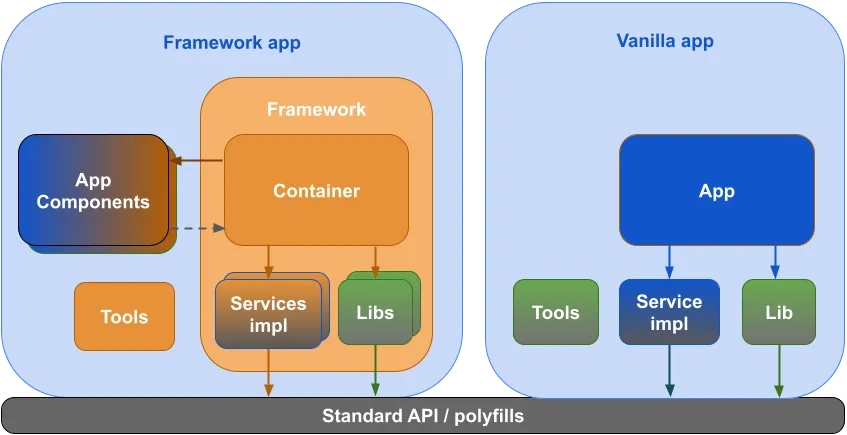

UI Frameworks can initially appear as intricate as a new programming language, leaving many to ponder the necessity of diving into them when raw HTML and CSS seem like simpler alternatives. However, beneath the veil of complexity lies a wealth of benefits that make the journey into UI frameworks undeniably rewarding.

## The Hidden Benefits

UI frameworks, despite their learning curve, offer substantial advantages that can transform your web development experience. They provide pre-designed components and styles, significantly speeding up the creation of web interfaces. Additionally, they ensure a consistent design throughout your application, sparing you from the inconsistencies often associated with haphazard HTML and CSS. 

Responsive design becomes more accessible, allowing you to craft websites that gracefully adapt to different screens. UI frameworks also alleviate the headache of compatibility issues across various browsers, providing a more consistent and predictable user experience. Furthermore, thriving communities surrounding these frameworks provide invaluable documentation, tutorials, and a wealth of third-party resources, making your development journey smoother and more supported.

## The Star Player

Among UI frameworks, Bootstrap 5 shines brightly as a user-friendly option that embodies simplicity and versatility. It streamlines the development process, ensuring both efficiency and consistency. Bootstrap's key features include a responsive grid system that simplifies the creation of flexible and responsive layouts, enhancing the user experience. It offers default styles while maintaining easy customization, allowing you to tailor your website's appearance to match your brand or artistic vision. 

Additionally, Bootstrap boasts an extensive library of UI components such as navigation bars and forms, saving you valuable development time. Not to be overlooked, Bootstrap places a strong emphasis on accessibility, ensuring that web applications are inclusive for users of all abilities, aligning with ethical standards and expanding the reach of your digital creations.

## UI Frameworks vs. Raw HTML and CSS

While the allure of simplicity may draw you toward raw HTML and CSS, this path comes with its own set of challenges. Building everything from scratch can be time-consuming, especially for complex layouts, and custom code is often less maintainable, leading to difficulties in managing future updates. Achieving design and user experience consistency becomes a daunting task without the guidance of a UI framework.

## Embrace the Challenge for Rich Rewards

UI frameworks, despite their initial complexities, offer an array of benefits that can greatly enhance your web development journey. Bootstrap 5, with its user-friendliness and versatility, streamlines development and ensures consistency in design and user experience. While raw HTML and CSS have their place, UI frameworks bring undeniable advantages to the table.

So, embrace the challenge, for UI frameworks unlock a world of possibilities and support for developers, making them an invaluable tool in the ever-evolving landscape of web development.
