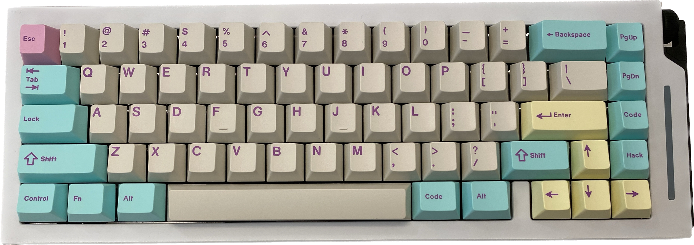
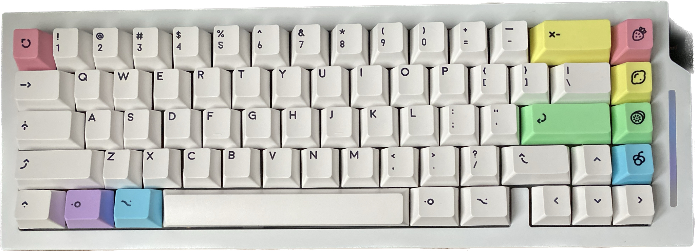

  

During the spike of covid, I explored my entrepreneurial endeavor, I embarked on a captivating project centered around crafting and selling personalized keyboards tailored to the unique preferences of tech enthusiasts and keyboard aficionados. 

### Processs
This venture involved an intricate process that spanned from conception to distribution. Sourcing top-tier components, I ensured the highest quality switches, keycaps, and cases to offer an unparalleled typing experience. The assemblage phase demanded precision soldering and meticulous attention to detail as each keyboard was meticulously brought to life.

### Reflection
My commitment to excellence extended to packaging and distribution, where careful handling guaranteed the keyboards reached their new owners in pristine condition. Through a harmonious fusion of technical expertise and creative customization, this project not only provided customers with a means of expression but also enabled me to immerse myself in the captivating realm of DIY electronics and entrepreneurship.

You can learn more about the world of custom keyboards in [Alextos' Intro To Keyboards](https://www.alexotos.com/into-custom-keyboards/).

