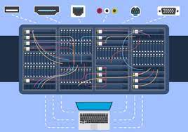

## Another Step Forward

Over the early part of this summer, I had the privilege of joining the John A. Burns School of Medicine's OIT (Office of Information Technology) department. In addition to handling basic IT tasks, I was introduced to the world of command-line operations and basic scripting. This exposure has been immensely valuable, as it has equipped me with the skills to diagnose and resolve computer issues, particularly when dealing with diverse operating systems and software, including compatibility challenges.

## Still Learning

The more I delve into my role, the more I discover. For instance, one of my supervisors has been guiding me through their current project, offering insights into a new website they're developing and the intricacies of their work. I'm also gaining a deeper understanding of SQL databases and JSON files, expanding my knowledge and skill set for the challenges ahead.

Debloat Script:

<pre>
iwr -useb https://christitus.com/win | iex
</pre>

OIT Department Site: [JABSOM OIT](https://oit.jabsom.hawaii.edu/)
