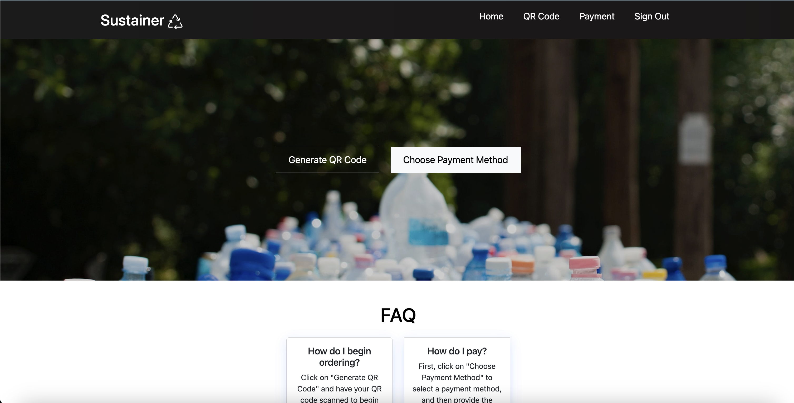

At the Hawaii Annual Code Challenge, my role encompassed UI design and front-end development for 'Sustainer', an app designed to address Zero Waste Oahu's reusable takeout program needs. My primary focus was optimizing the app's performance for mobile platforms, adopting a mobile-first design strategy while ensuring an appealing visual interface. Balancing the requirements for both mobile and desktop interfaces was a complex task, especially when dealing with CSS box model intricacies, but my commitment and eagerness to learn helped me excel in this role.

As the principal front-end developer, I went beyond just handling Bootstrap and CSS. I actively engaged with team members, integrating their developed features into the user interface. This teamwork fostered effective communication and allowed us to jointly refine the app's visual and functional aspects, aiming for success in the challenge.

## Overcoming Obstacles

Scheduling conflicts posed a significant challenge, as our team members were engaged with varying class and work schedules, limiting our meetings to twice weekly. To overcome this, we meticulously planned our sessions, ensuring maximal productivity and individual accountability for team contributions.

Additionally, we encountered a technical issue where new users were redirected to a blank page instead of the homepage after signing up. Despite my usual focus on front-end tasks, I tackled this challenge head-on, eventually resolving the issue. This not only demonstrated my commitment to the team's success but also my willingness to expand beyond my typical responsibilities.

This project was a profound learning experience, boosting my confidence as a programmer. I eagerly anticipate participating in future Hawaii Annual Code Challenges and other hackathons, applying and enhancing my skills for impactful contributions to upcoming projects.
